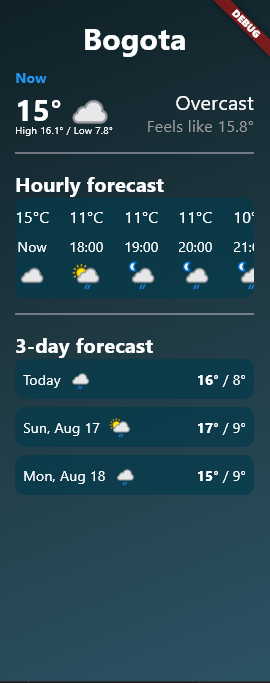

# APP CLIMATE
Una app hecha con flutter. Muestra el clima en bogota (por ahora) es un proyecto de practica que muestra el clima en diferentes partes del mundo

## Plataformas compatibles
Android

## Configuración

### Instalación:
- Clonar el repositorio: ```bash git clone <URL_DEL_REPOSITORIO>```
- Navegar al directorio del proyecto:```bash cd <nombre_del_proyecto>```
- Instalar dependencias: flutter ```bash pub get```
### Ejecución:
- Ejecutar la aplicación en un dispositivo o emulador: ```flutter run```

## Estructura del proyecto:
lib/providers/weatherapi_provider_dart:
En esta direcion esta el llamado a la api de [**WeatherAPI**]{[text](https://www.weatherapi.com/api-explorer.aspx)}.
el cual recibe un parametro de **location** el cual servira para modificar el lugar del clima visualizado.

lib/main.dart:
este es la visualizacion de la app en donde se encuentra todos los apartados de la app.
## Imagen del proyecto

